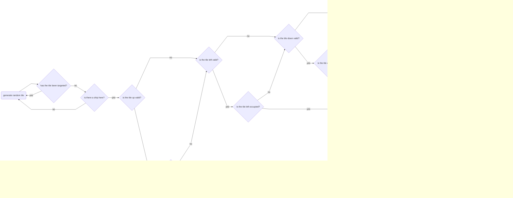

# Battleship_SE11
Repo housing Battleship project implementation and resources
## AI evaluation 

```mermaid

%%{init: { "flowchart": { "curve": "linear" } } }%%
flowchart LR
gen(generate random tile)

gen_check{has the tile been targeted?}

occpancy_check{is there a ship here?}

  

valid_tile_up{is the tile up valid?}
valid_tile_down{is the tile down valid?}
valid_tile_left{is the tile left valid?}
valid_tile_right{is the tile right valid?}


check_tile_up{is the tile up occupied?}
check_tile_down{is the tile down occupied?}
check_tile_left{is the tile left occupied?}
check_tile_right{is the tile right occupied?}

  
  

error{{error state reached}}

gen-->gen_check

gen_check-->|yes|gen

gen_check -->|no|occpancy_check

occpancy_check-->|no|gen

occpancy_check-->|yes|valid_tile_up

subgraph ends  
	vendstate_1{{init point is the bottom of the ship}}
	vendstate_2{{init point is somewhere in the vertical middle of the ship}} 
	vendstate_3{{init point is the top of the ship}}
	hendstate_1{{init point is the right of the ship}}
	hendstate_2{{init point is somewhere in the horizontal middle of the he ship}} 
end
valid_tile_up-->|no|valid_tile_left
valid_tile_up-->|yes|check_tile_up
check_tile_up-->|no|valid_tile_left
check_tile_up-->|yes|validdown
validdown{is the tile down valid}
validdown-->|yes|checkdown
validdown-->|no|vendstate_1
checkdown{is the tile down occupied}
checkdown-->|no|vendstate_1
checkdown-->|yes|vendstate_2

valid_tile_left-->|no|valid_tile_down
valid_tile_left-->|yes|check_tile_left
check_tile_left-->|no|valid_tile_down
check_tile_left-->|yes|validright
validright{is the tile right valid}
validright-->|no|hendstate_1
validright-->|yes|checkright
checkright{is the tile right occupied}
checkright-->|no|hendstate_1
checkright-->|yes|hendstate_2

valid_tile_down-->|no|valid_tile_right
valid_tile_down-->|yes|check_tile_down
check_tile_down-->|no|valid_tile_right
check_tile_down-->|yes|validup
validup{is the tile up valid}
validup-->|no|vendstate_3
validup-->|yes|checkup
checkup{is the tile up occupied}
checkup-->|no|vendstate_3
checkup-->|yes|vendstate_2

valid_tile_right-->|no|error
valid_tile_right-->|yes|check_tile_right
check_tile_right-->|no|error
check_tile_right-->|yes|validleft
validleft{is the tile left valid}
validleft-->|no|hends
```
